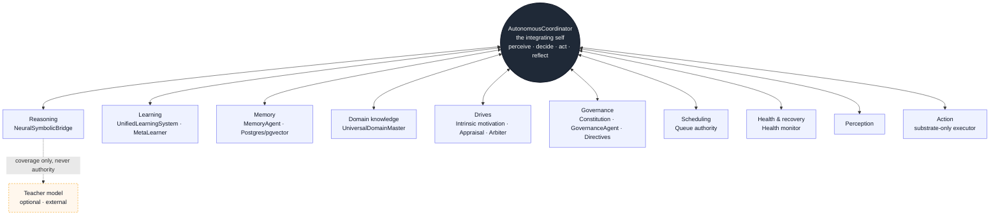

# TorinAI

**A persistent, model-optional cognitive architecture — a system that *derives*
answers from evidence it holds, instead of *generating* text that looks like
answers.**

TorinAI is a research codebase. It is large, so this README is written to get you
oriented fast: what it is, how the pieces fit, which files matter, and how to run
it. The deeper theory lives in linked docs — start here, go deep later.

---

## In one minute

Most AI systems produce an answer for every input and attach a confidence they
simply assert. TorinAI is built the other way around:

- It **reasons over facts it actually holds** and keeps the derivation — you can
  always ask *why* it believes something.
- Its **confidence is computed**, never declared — each kind of inference has its
  own honest arithmetic behind the number.
- It can **say "I can't represent this"** — a real, distinct result, not a
  low-confidence guess.
- It **runs without a language model.** A model, if you connect one, is only a
  *teacher*: it can help read an input the system can't yet parse, or suggest a
  candidate the system will then check itself. It is never required and never has
  the final say.

The system grows by being **taught**, not pre-trained — the trade it makes is
reliability within what it knows, at the cost of coverage that has to be built up.

---

## How it fits together

One component sits at the center — the **AutonomousCoordinator** — and every
faculty plugs into it. We call it the system's **self** in a strictly functional
sense: it is the single place where the system's state, drives, and identity are
integrated, and the place from which all behavior originates. (Nothing mystical is
meant by the word — it is the integrating hub, the way a nervous system integrates
organs.)



The self runs a continuous loop — perceive, decide, act, reflect — and reacts to
**events** (a task finished, an outcome was observed, competence changed) rather
than polling on a clock. Each faculty is an **authority**: the one component that
owns its concept. Reasoning is owned by the reasoning authority, learning by the
learning authority, and so on. Nothing bypasses an authority or stands up a second
one for the same job. The teacher model sits *outside* this — reachable only for
coverage, never in the decision path.

---

## Main systems & where they live

This is a big codebase. If you read nothing else, read this table — it maps each
system to the file that owns it (sizes are approximate, to show weight).

| System | What it does (plainly) | Key file | ~lines |
|---|---|---|---|
| **The self** | The central loop: perceives, decides, acts, reflects; dispatches events; holds motivation, appraisal, identity. Everything plugs in here. | `core/agents/autonomous/autonomous_coordinator.py` | 12,000 |
| **Reasoning authority** | The one door to reasoning. Tries to *prove*, then *derive*, then (last) *propose*. Routes to solvers and the eleven kinds of inference. | `core/reasoning/neural_bridge.py` | 3,400 |
| **The eleven kinds of inference** | Deductive, inductive, abductive, analogical, causal, probabilistic, fuzzy, temporal, spatial, logical, counterfactual — each with its own honest confidence math. | `core/reasoning/abstract_reasoning_engine.py` | 3,100 |
| **Abstraction** | Turns clustered experience into reusable probabilistic *schemas* (a 4-level concept lattice). | `core/reasoning/hierarchical_abstraction.py` | 2,500 |
| **Beliefs & uncertainty** | Bayesian beliefs with computed entropy, temporal decay, consistency, and calibration. | `core/reasoning/bayesian_uncertainty.py` | 1,700 |
| **Learning authority** | Owns *what the system learns*. Contributors propose; it decides. | `core/learning/unified_learning_system.py` | 2,500 |
| **MetaLearner** | Owns *which choice works* (task type, executor, directive) via a credit-assigning bandit. | `core/learning/meta_learning.py` | 1,500 |
| **Memory** | Stores and retrieves memories (PostgreSQL + pgvector); runs maintenance loops. | `core/agents/memory_agent.py` | 3,900 |
| **Domain knowledge** | The system's map of subjects; grows domains from real outcomes. | `core/integration/universal_domain_master.py` | 2,400 |
| **Drives** | Curiosity / competence / novelty / impact motivation, plus affect. | `core/agents/autonomous/intrinsic_motivation.py` | 3,500 |
| **Constitution** | Five immutable governance laws; assesses system drift; scores actions/policies against the laws. | `core/agents/autonomous/singleton_constitution.py` | 650 |
| **Governance agent** | The compliance *decision* authority — allow/block an action against the laws. | `core/agents/autonomous/governance_agent.py` | 640 |
| **Directives** | Mutable operating policies the system *self-proposes*, has *governed*, *learns*, and *applies*. | `core/agents/autonomous/directive_system.py` (+ `directive_*.py`) | 670 |
| **Scheduling** | The one owner of "what runs when" — recurring jobs, background work, awaits. | `core/agents/autonomous/queue_authority.py` | 960 |
| **Health & recovery** | Monitors subsystems; drives diagnose → recover → verify on events. | `core/health/health_monitor.py` | 3,600 |
| **Bring-up / orchestration** | Constructs and initializes the whole system; the entrypoint. | `core/main.py` | 2,100 |
| **Teacher model (optional)** | The optional LLM service — used only for coverage. The system runs without it. | `core/services/unified_llm.py` | 3,000 |

The reasoning subsystem has several more focused engines worth knowing:
`advanced_proof_engine.py` (Z3/SMT proofs), `constraint_solver.py` (Z3 CSP),
`relation_algebra.py` (typed relations — so *reachability is never mistaken for
entailment*), `epistemic_engine.py` (turns tool observations into beliefs and
surfaces what to explore), and `temporal_reasoning.py` / `hypothesis_testing.py` /
`formal_argumentation.py` / `analogy_discovery.py`.

---

## The core ideas (a little deeper)

You don't need this section to run the system, but it's the "why."

**The order of resort — for every request.** First, *what can be proved*:
deterministic readers turn the query into the system's own grammar and a solver
decides it (arithmetic → a constraint solver; sequences → rule induction;
relational queries → the concept graph; propositions → the SMT prover). Second,
*what can be derived*: the eleven kinds of inference run, each deciding for itself
whether the material it needs is present. Only third, and only for coverage, is a
model asked to *propose* — and anything it proposes is re-checked before it counts.

**Confidence is computed, not declared.** Induction uses Laplace's rule of
succession over confirmations and counterexamples; a causal chain is only as
strong as its weakest link; a fuzzy claim carries a *degree* separate from
*certainty*; a failed proof yields no conclusion, never a weak "yes."

**Declining is a result.** "Proved," "derived," "not entailed," and "cannot
represent" are distinct outcomes recorded in metadata — so a confident answer
actually means something.

**Single authority, honesty over green.** One owner per concept; a component that
can't do its work surfaces the honest gap and a metric, and never stamps a fake
success to clear a queue. Completions are *verified* against re-observed world
evidence, not self-declared.

See the reasoning papers for the full treatment:
[`REASONING.md`](core/reasoning/REASONING.md),
[`REASONING_PIPELINE.md`](core/reasoning/REASONING_PIPELINE.md),
[`REASONING_PATHS_VERIFIED.md`](core/reasoning/REASONING_PATHS_VERIFIED.md).

---

## The model is optional

The system reasons, learns, and acts model-free on its core paths. If you connect
a language model (`core/services/unified_llm.py`), it plays exactly one role: a
**teacher** for *coverage* — reading an input the system can't yet parse, or
proposing a candidate the system re-parses and checks. Model proposals carry no
confidence of their own, rank below every derived conclusion, and are marked as
proposals wherever they're stored. Disconnect it and the system still reasons — it
just reads fewer kinds of input.

---

## Getting started

**Requirements**

- **Python 3.11** (this repo uses a `venv_torin` virtualenv on 3.11.x).
- **PostgreSQL** with the **pgvector** extension (default local DB: `torinai_db`
  on port `5433`).
- *Optional:* a local LLM endpoint for the teacher role.

**Install**

```bash
python3.11 -m venv venv_torin
./venv_torin/bin/pip install -r requirements.txt
```

**Configure** — environment is loaded from `.env.production`, then `.env` (local
overrides):

```
POSTGRES_HOST=localhost
POSTGRES_PORT=5433
POSTGRES_DATABASE=torinai_db
POSTGRES_USER=...
POSTGRES_PASSWORD=...
LLM_SERVER_URL=http://localhost:8099   # optional teacher; omit to run model-free
```

**Run** — the system is orchestrated by `core/main.py`:

```bash
PYTHONPATH="$PWD" ./venv_torin/bin/python3 -m core.main
```

**Or bring it up programmatically:**

```python
from core.main import get_system
system = get_system()
await system.initialize()
coord = system.autonomous_coordinator          # the self
```

---

## Testing

Tests live under `tests/`, organized by subsystem (`reasoning/`, `memory/`,
`learning/`, `autonomous/`, `governance/`, `integration/`, `chaos/`, …) and run
against **real backends** — nothing is stubbed. Example (the eleven reasoning
paths, verified end-to-end):

```bash
PYTHONPATH="$PWD" ./venv_torin/bin/python3 tests/reasoning/test_eleven_paths_real.py
```

---

## Repository layout

```
core/
  main.py                     # bring-up + orchestration (the entrypoint)
  agents/
    autonomous/               # the self: coordinator, drives, appraisal, arbiter,
                              #   queue authority, constitution, directives + governance
    memory_agent.py           # memory authority (Postgres + pgvector)
  reasoning/                  # reasoning authority + the eleven kinds, proofs, beliefs,
                              #   abstraction, relation algebra, epistemic engine
  learning/                   # learning authority, MetaLearner, rule induction
  integration/                # domain authority (UniversalDomainMaster)
  semantics/                  # reading/formalization: turning language into solver terms
  memory/                     # storage, retrieval, embeddings
  governance/ · security/ · safety/   # runtime governance & safety framework
  health/                     # health monitor + recovery
  services/                   # optional teacher-model service (unified_llm.py)
  database/                   # unified PostgreSQL access
tests/                        # subsystem tests, run against real backends
docs/                         # architecture maps, audits, lab notebook, papers
experiments/                  # EDU-* / SESSION-* research writeups (each has a README)
archive/                      # superseded / model-era modules kept for provenance
```

---

## Documentation

- **Reasoning:** [`REASONING.md`](core/reasoning/REASONING.md) ·
  [`REASONING_PIPELINE.md`](core/reasoning/REASONING_PIPELINE.md) ·
  [`REASONING_PATHS_VERIFIED.md`](core/reasoning/REASONING_PATHS_VERIFIED.md)
- **Architecture maps:** [`docs/ARCHITECTURE_GRAPH.md`](docs/ARCHITECTURE_GRAPH.md) ·
  [`docs/AUTONOMOUS_COORDINATOR_MAP.md`](docs/AUTONOMOUS_COORDINATOR_MAP.md) ·
  [`docs/AFFECT_ARCHITECTURE.md`](docs/AFFECT_ARCHITECTURE.md) ·
  [`docs/SAFETY_ARCHITECTURE.md`](docs/SAFETY_ARCHITECTURE.md)
- **On keeping the model optional:** [`docs/LLM_RETIREMENT.md`](docs/LLM_RETIREMENT.md) ·
  [`docs/LLM_CALLSITE_MAP.md`](docs/LLM_CALLSITE_MAP.md)
- **Lab notebook & audits:** [`docs/LAB_NOTEBOOK.md`](docs/LAB_NOTEBOOK.md) and the
  `*_AUDIT*.md` files under `docs/`.

---

## Status & honest limitations

TorinAI is an **experimental research architecture**, not a product. Stated at the
same resolution as the capabilities:

- **Reading is the main constraint.** The system reasons well over its own
  notation and cannot yet read arbitrary English at the same fidelity; coverage
  grows by teaching, and closing this gap is where much of the work is.
- **Coverage is narrow and accumulates** — every kind of inference works over what
  the system has been taught to represent.
- **Some engines implement a reduced subset** of the theory they cite (documented
  honestly in `REASONING_PIPELINE.md` rather than glossed over).
- **Model-optional doesn't mean feature-complete without a model** — a model still
  widens the kinds of input the system can read.

Where you find a claim here, expect the code — and usually a test or a
measurement — behind it. Where you find a limitation, expect it stated plainly.

---

*Dominion Labs — Cognitive Substrate Series.*
